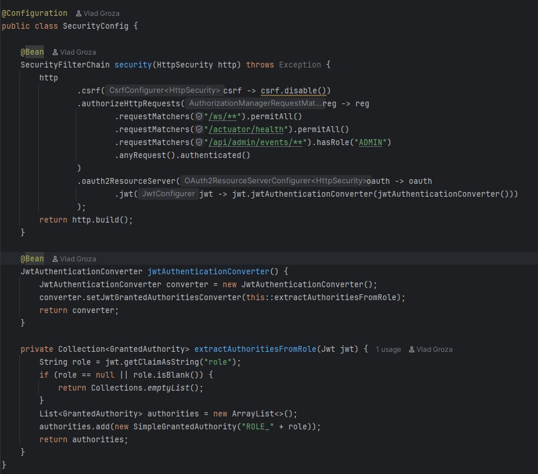
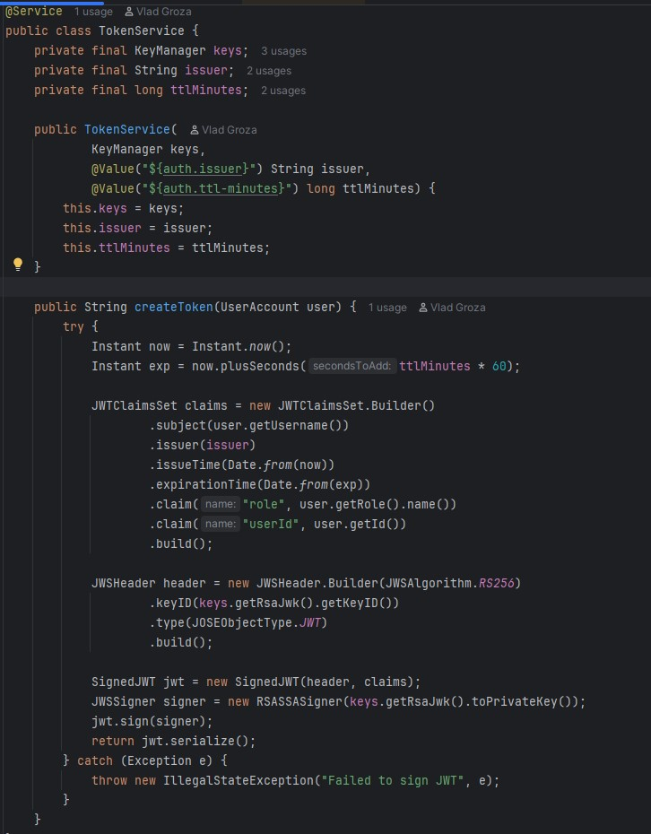
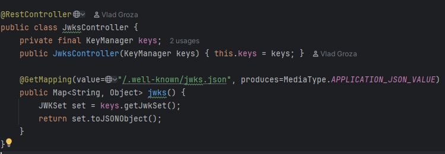

# Securing a REST API - Tutorial

This tutorial shows how we secure the REST APIs in the MedApp microservice architecture: how authentication, authorization, token issuance and request validation across multiple microservices is managed.

## Why API Security Matters (and why JWT)

In a microservices-based application, many services expose REST APIs that must be protected from unauthorized access. Stateless authentication is preferred over session-based approaches, because it's scalable and works across distributed services without centralized state.

We use JSON Web Tokens (JWT) for this purpose. A JWT is a signed token containing claims (such as user identity, roles), compact and URL-safe, which clients send with each request. The server validates the signature (and optionally expiration/issuer claims), and if valid, treats the request as coming from an authenticated user.

**Benefits:**

- Stateless: no sessions to store; scalable across microservices.

- Self-contained: token carries identity and authorization data.

- Compatible with REST and microservices.

## Overview of Our Implementation in MedApp

### Services

- Auth Service - issues JWT tokens after login, exposes JWKS key set (public keys)

- Other microservices (Patient, Doctor, Appointment, Notification, Admin-Events) - act as resource servers, validating JWT tokens on each request, enforcing role-based access

### Security stack

Spring Boot 4.x + Spring Security, using spring-boot-starter-oauth2-resource-server.
JWT signed with RSA (RS256).

Authorization via role/authority (e.g. ROLE_PATIENT, ROLE_DOCTOR, ROLE_ADMIN).

## Step-by-step Implementation

Below are the general steps — aligned with how our system is built.

**1. Add dependencies (Maven / Spring Boot)**

In each microservice that needs to act as resource server, add:

```xml
<dependency>
  <groupId>org.springframework.boot</groupId>
  <artifactId>spring-boot-starter-oauth2-resource-server</artifactId>
</dependency>
<dependency>
  <groupId>org.springframework.boot</groupId>
  <artifactId>spring-boot-starter-security</artifactId>
</dependency>
```

This includes Spring Security + support for verifying JWT bearer tokens.

**2. Configure security**

In each protected service, define a SecurityConfig like:



This tells Spring Security to:

- Expect a Bearer token (JWT) in Authorization header for non-public endpoints
- Validate signature, expiration, issuer using configured JWT settings
- Enforce access control based on authorities/roles

**3. JWT issuance in Auth Service**

In the Auth Service (the “authorization server” in our setup), when a user logs in:

- Validate credentials (username + password).

- Generate a signed JWT with claims:

  - sub = username (or user id)

  - role = user role (e.g. PATIENT, DOCTOR, ADMIN)

  - iss = identifier/issuer

  - iat, exp = issued-at and expiration timestamps

**Example of token creation**



Then return to client (in login response):

```json
{
  "accessToken": "eyJ...",
  "tokenType": "Bearer"
}
```

**4. The Role of the JWKS**

A critical part of securing a distributed system with JWT is enabling all microservices to verify tokens issued by the Auth Service — without sharing private keys.

To solve this, the industry-standard JWKS (JSON Web Key Set) mechanism can be used. This is implemented via the following controller:



JWTs are signed using RS256 (RSA asymmetric cryptography), which means:

- The Auth Service uses the private key to sign every JWT.
- Other microservices only need the public key to verify the signature.

But instead of embedding the public key manually in each microservice (which is insecure, hard to maintain, and breaks rotation), we expose a JWKS endpoint:

```
GET /.well-known/jwks.json
```

A typical JWKS response looks like:

```json
{
  "keys": [
    {
      "kty": "RSA",
      "kid": "auth-key-1",
      "alg": "RS256",
      "use": "sig",
      "n": ".... base64 modulus ....",
      "e": "AQAB"
    }
  ]
}
```

**5. Frontend usage**

All frontends include the JWT in the Authorization header of API calls. Based on the role embedded in the token, frontends only show the relevant UI (patient, doctor, admin).

When the user tries to access protected APIs without token or with invalid token -> backend returns `401` Unauthorized.
If token is valid but lacks required authority -> `403` Forbidden.

**6. Propagating and validating inside microservices**

Because each microservice uses the same JWT verification logic (via Spring Security), and trusts the same public key set (provided by Auth Service via JWKS), they do not need to maintain sessions, nor reauthenticate.

This makes the architecture scalable and decoupled.

## Summary & What’s Next

In this tutorial, you learned how to secure a REST API in a Spring-Boot microservice architecture using JWT and Spring Security. You saw how Auth Service issues tokens, how resource services validate them, and how to enforce role-based authorization.

If you want to extend this:

- Add refresh tokens and token revocation (in case you want to force logouts).
- Add claim-based authorization (e.g. scopes, permissions, resource ownership checks).
- Use HTTPS/TLS, ensure tokens are transmitted securely.
- Improve error handling and logging, especially for unauthorized or invalid requests.

### References

All the code described is implemented in our MedApp repository:

- `Auth Service` -> /services/auth-service

- Each other microservice (Patient, Doctor, Appointment, etc) includes `spring-boot-starter-oauth2-resource-server` and appropriate `SecurityConfig`

- Example config properties:

```yaml
spring:
  security:
    oauth2:
      resourceserver:
        jwt:
          jwk-set-uri: http://auth-service:9000/.well-known/jwks.json
```
